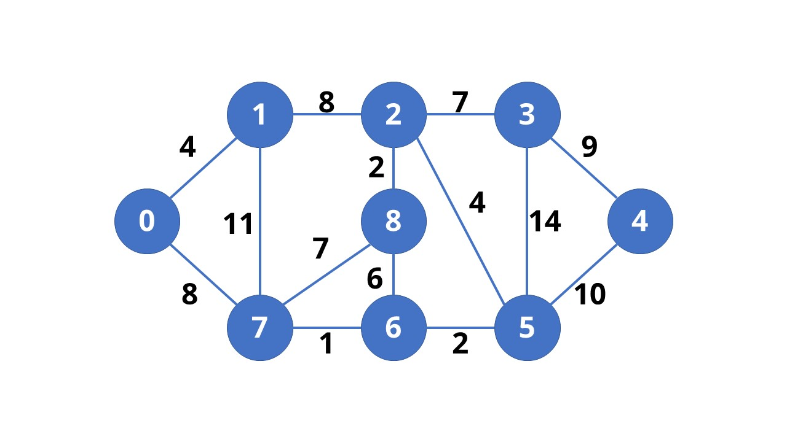
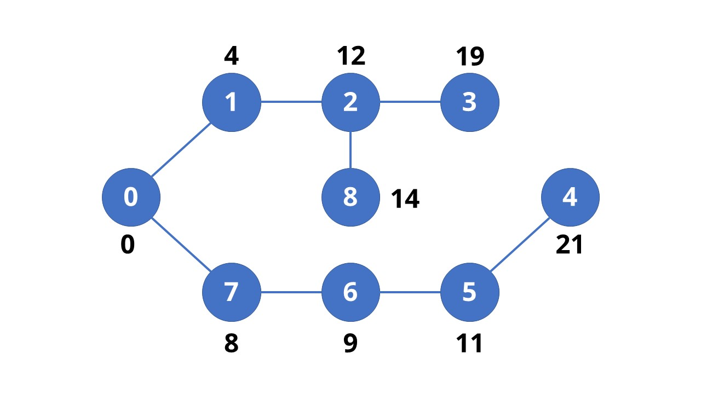

# Algoritma Dijkstra

## Pendahuluan

Algoritma Dijkstra adalah suatu algoritma yang digunakan untuk mencari jalur terpendek di antara dua vertex/node dalam suatu graf. Algoritma ini ditemukan oleh seorang ilmuwan komputer Dr. Edsger W. Dijkstra pada tahun 1959.

Sekarang, algoritma Dijkstra lebih banyak digunakan untuk menghitung jarak dari suatu node ke masing-masing node lainnya yang disimpan dalam tree (*shortest path tree*). Penggunaan algoritma ini dalam kehidupan nyata cukup beragam, mulai dari mencari jarak terdekat antara lokasi hingga *machine learning*. Sayangnya, algoritma ini tidak dapat digunakan untuk graf yang memiliki edge dengan nilai negatif.

## Algoritma

Algoritma Dijkstra dapat dibuat den gan membuat set yang berisi keterangan apakah vertex sudah dimasukkan ke dalam *shortest path tree* menggunakan tipe boolean, dengan nilai `true` berarti sudah dimasukkan (jarak terdekatnya sudah dihitung) dan `false` berarti belum.
Lalu, buat suatu array yang menyimpan nilai jarak antar vertex. Array ini akan diinisialisasi dengan nilai INFINITE (atau direpresentasikan dengan angka yang sangat besar). Inisialisasi nilai jarak dari vertex sumber menjadi 0 agar dipilih paling pertama.
Lalu, lakukan looping selama vertex masih ada yang belum masuk ke *shortest path tree*. Di dalam looping, dilakukan langkah sebagai berikut:

1. Ambil sebuah vertex bernama u yang belum masuk ke *shortest path tree* dan memiliki nilai jarak terendah.
2. Masukkan vertex itu ke dalam tree.
3. Perbarui jarak semua vertex (v) yang terhubung dengan vertex u dengan melakukan looping pada tiap vertexnya dengan ketentuan perbarui jika penjumlahan jarak u dari vertex sumber dengan jarak u-v kurang dari nilai jarak v yang tercatat pada array.

## Contoh Implementasi

Contoh Implementasi: (diambil dari GeeksForGeeks)

```cpp
// A C++ program for Dijkstra's single source shortest path algorithm.
// The program is for adjacency matrix representation of the graph

#include <limits.h>
#include <stdio.h>

// Number of vertices in the graph
#define V 9

// A utility function to find the vertex with minimum distance value, from
// the set of vertices not yet included in shortest path tree
int minDistance(int dist[], bool sptSet[])
{
	// Initialize min value
	int min = INT_MAX, min_index;

	for (int v = 0; v < V; v++)
		if (sptSet[v] == false && dist[v] <= min)
			min = dist[v], min_index = v;

	return min_index;
}

// A utility function to print the constructed distance array
void printSolution(int dist[])
{
	printf("Vertex \t\t Distance from Source\n");
	for (int i = 0; i < V; i++)
		printf("%d \t\t %d\n", i, dist[i]);
}

// Function that implements Dijkstra's single source shortest path algorithm
// for a graph represented using adjacency matrix representation
void dijkstra(int graph[V][V], int src)
{
	int dist[V]; // The output array. dist[i] will hold the shortest
	// distance from src to i

	bool sptSet[V]; // sptSet[i] will be true if vertex i is included in shortest
	// path tree or shortest distance from src to i is finalized

	// Initialize all distances as INFINITE and stpSet[] as false
	for (int i = 0; i < V; i++)
		dist[i] = INT_MAX, sptSet[i] = false;

	// Distance of source vertex from itself is always 0
	dist[src] = 0;

	// Find shortest path for all vertices
	for (int count = 0; count < V - 1; count++) {
		// Pick the minimum distance vertex from the set of vertices not
		// yet processed. u is always equal to src in the first iteration.
		int u = minDistance(dist, sptSet);

		// Mark the picked vertex as processed
		sptSet[u] = true;

		// Update dist value of the adjacent vertices of the picked vertex.
		for (int v = 0; v < V; v++)

			// Update dist[v] only if is not in sptSet, there is an edge from
			// u to v, and total weight of path from src to v through u is
			// smaller than current value of dist[v]
			if (!sptSet[v] && graph[u][v] && dist[u] != INT_MAX
				&& dist[u] + graph[u][v] < dist[v])
				dist[v] = dist[u] + graph[u][v];
	}

	// print the constructed distance array
	printSolution(dist);
}

// driver program to test above function
int main()
{
	/* Let us create the example graph discussed above */
	int graph[V][V] = { { 0, 4, 0, 0, 0, 0, 0, 8, 0 },
						{ 4, 0, 8, 0, 0, 0, 0, 11, 0 },
						{ 0, 8, 0, 7, 0, 4, 0, 0, 2 },
						{ 0, 0, 7, 0, 9, 14, 0, 0, 0 },
						{ 0, 0, 0, 9, 0, 10, 0, 0, 0 },
						{ 0, 0, 4, 14, 10, 0, 2, 0, 0 },
						{ 0, 0, 0, 0, 0, 2, 0, 1, 6 },
						{ 8, 11, 0, 0, 0, 0, 1, 0, 7 },
						{ 0, 0, 2, 0, 0, 0, 6, 7, 0 } };

	dijkstra(graph, 0);

	return 0;
}
```

Contoh graf yang digunakan:


*Shortest path tree* yang dihasilkan:


Referensi:

1. <https://www.geeksforgeeks.org/dijkstras-shortest-path-algorithm-greedy-algo-7/>
2. <https://www.freecodecamp.org/news/dijkstras-shortest-path-algorithm-visual-introduction/>
